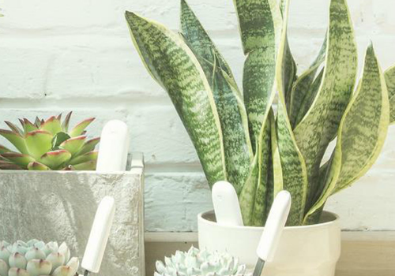

# Xiaomi mi flora sensor

## Introduction
This app integrates the `Xiaomi mi flora sensor` and `Xiaomi mi flora ropot` into Homey.

Do you like the app? You can make me happy by buying me a beer! 

## Q&amp;A

> **Q1**  Why can’t the sensor be found by Homey?

* _Check if the sensor is connected to another bluetooth device. The  `Xiaomi Mi Flora`  app for example_

> **Q1**  Why are the readings from the sensors different from in the  `Xiaomi Mi Flora`  app?

* _It is caused by old firmware (2.7.0), try to update the sensors through the  `Xiaomi Mi Flora`  app_

> **Q3**  Is the app compatibel with v2.0.0?

* The app is only compatible from v2.1.2 and up due to change to the BLE core.

> **Q4**  Is the app compatibel with SDK 3?

* Yes the app is compatible from v3.0.0

## Usage
1. Install app
2. Add the device(s) to Homey.
3. Configure the threshold in the device configuration.
4. Make a flow with one of the cards.

You can configure the timeout between polls in the app's settings.

## Cards
### Device cards
#### Trigger cards
1. Some device sensor has changed.
   * sensor (Moisture)
   * value (20%)
   * report (The moisture of Flora 1 has changed to: 20%.)
2. Some device sensor is updated.
   * sensor (Moisture)
   * value (20%)
   * report (The moisture is updated to: 20%.)
3. Sensor value is below the configured threshold.
   * sensor (Moisture)
   * value (20%)
   * report (The moisture (20%) is too low. This can be at least 30%.)
4. Sensor value is above the configured threshold.
   * sensor (Moisture)
   * value (20%)
   * report (The moisture (20%) is too high. This must be a maximum of 15%.)

#### Condition cards
1. De plant has a correct temperature.
2. De plant has enough sunlight.
3. De plant has enough nutrition.
4. De plant has enough moisture.

### Global cards
#### Trigger cards
1. Some device sensor has changed.
   * device (Flora 1)
   * sensor (Moisture)
   * value (20%)
   * report (The moisture has changed to: 20%.)
2. Some device sensor is updated.
   * device (Flora 1)
   * sensor (Moisture)
   * value (20%)
   * report (The moisture is updated to: 20%.)
3. Sensor value is below the configured threshold.
   * device (Flora 1)
   * sensor (Moisture)
   * value (20%)
   * report (The moisture (20%) is too low. This can be at least 30%.)
4. Sensor value is above the configured threshold.
   * device (Flora 1)
   * sensor (Moisture)
   * value (20%)
   * report (The moisture (20%) is too high. This must be a maximum of 15%.)
5. Sensor value is outside the configured threshold.
   * device (Flora 1)
   * sensor (Moisture)
   * value (20%)
   * report (The moisture (20%) is too high. This must be a maximum of 15%.)
6. Sensor gives a timeout after 3 tries.
   * device (Flora 1)
   * reason (Not in range)
   
#### Condition cards
1. De plant has a correct temperature.
2. De plant has enough sunlight.
3. De plant has enough nutrition.
4. De plant has enough moisture.

#### Action cards
1. Synchronise all sensor values with Homey.
   
## History
### v1.0.0 - 09.04.2018
  * first alpha to app store.
### v1.0.1 - 10.04.2018
  * add documentation
  * revert changes because it breaks the flow card.
### v1.0.2 - 17.04.2018
  * moved capabilities to drivers because of RoPot missing one.
  * update capability name from fertilizer to nutritions.
  * change tags for `capability` in card to user preferred language.
  * add tags: `report` with a human readable report of the status.
### v1.0.3 - 17.04.2018
  * add missing battery report translation
### v1.0.4 - 18.04.2018
  * add missing icon
  * add documentation to readme
### v1.0.5 - 20.04.2018
  * bump 1.0.4
### v1.0.6 - 23.04.2018
  * bump 1.0.5
### v1.0.7 - 27.04.2018
  * change trigger min/max with correct translation
  * fixed validation error
  * remove unused try catch
  * add trigger: 'outside threshold'
  * add documentation
  * bubble up error and throw exception, but before that add new timeout
### v2.0.0 - 17.05.2018
  * make drivers compatible with com.mi.flora
  * refactoring capabilities
  * add settings explanation for threshold
  * add min/max validation for threshold
### v2.0.1 - 18.05.2018
  * change app id
### v2.0.2 - 18.05.2018
  * mark device as broken due to missing capability battery
### v2.0.3 - 25.05.2018
  * add support for ropot condition cards
### v2.0.4 - 25.05.2018
  * add information on the pairing screen
### v2.0.5 - 25.05.2018
  * removed test code
### v2.0.6 - 25.05.2018
  * resolved merge conflicts
### v2.0.7 - 17.08.2018
  * resolved issue: https://github.com/koktaildotcom/homey-mi-flora/issues/34 (Too many settings available for RoPot)
### v2.0.8 - 17.08.2018
  * resolved issue: https://github.com/koktaildotcom/homey-mi-flora/issues/41 (App crash due to missing condition card arguments)
### v2.0.9 - 01.10.2018
  * resolved issue: https://github.com/koktaildotcom/homey-mi-flora/issues/45 (Add a trigger card: Device is `out of range`)
  * add homeyCommunityTopicId for linking to new community forum
  * add html report for sending status report as email 
  * improve error handling and prevent `un-disconnected` devices
### v2.0.10 - 01.10.2018
  * add missing dependencies
### v2.0.11 - 01.10.2018
  * add missing dependencies
### v2.0.12 - 01.10.2018
  * improve settings page
  * verbose forced disconnect from BLE after error
### v2.0.13 - 20.10.2018
  * filter the existing devices out of the device list on pairing
  * add readable time format to HTML report
### v2.0.14 - 24.10.2018
  * throw error and stop loading if no devices can be found
### v2.0.15 - 11.11.2018
  * add version number app for logging
  * improve check on available settings
  * make html rapport generating optional
  * add uuid to device settings for flora sensor
### v2.0.16 - 11.11.2018
  * resolved ManagerSettings get exception
  * improve handling exceptions
  * limit timeout by 5 seconds
  * use a different strategy based on homey version
### v2.0.17 - 11.12.2018
  * add BLE permission into manifest
### v2.0.18 - 12.12.2018
  * removed BLE permission into manifest due to incompatibility with < v2.0.0
### v2.0.19 - 21.12.2018
  * removed html report to prevent cpu warns
  * changed version number strategy because it failed with on 2.0.0
  * try to resolve `not setting a timer on exception` issue
### v2.1.0 - 11.01.2019
  * trigger flows static thought the app (best practice 2.0)
  * rewrite the update sequence part for better performance
  * try to resolve issue with a bug https://github.com/athombv/homey-apps-sdk-issues/issues/11
  * try to resolve issue with a bug https://github.com/athombv/homey-apps-sdk-issues/issues/7
  * fixed typo bug `true` => `this` in the `Homey.FlowCardTriggerDevice`
### v2.1.1 - 05.03.2019
  * refactor to the previous iteration strategy
### v2.1.2 - 14.03.2019
  * connect to service directly
### v2.1.3 - 15.03.2019
  * fixed bug that gives an error on pairing
  * moved update sequence to app to centralize
  * add callback on added device so updating starts right away
### v2.1.4 - 15.03.2019
  * add identify possibility into settings
  * add initializing the retry counter before fail scenario
  * improve catching the exceptions within the handling function
### v2.1.4 - 15.03.2019
  * add identify possibility into settings
### v2.1.5 - 17.03.2019
  * bump version due to invalid build
### v2.1.6 - 22.03.2019
  * call the callback after saving the settings to prevent throwing an error
  * change the min/max to better threshold
### v2.1.7 - 20.04.2019
  * removing the update device after pairing https://github.com/koktaildotcom/homey-mi-flora/issues/70
  * renaming condition cards because of unknown behaviour https://github.com/koktaildotcom/homey-mi-flora/issues/71
### v2.1.8 - 20.04.2019
  * bump version v2.1.7 because its is rejected from the store somehow
### v2.1.9 - 27.04.2019
  * try to discovery services with every update to prevent [sequence bug](https://github.com/athombv/homey-apps-sdk-issues/issues/73) (only compatible with >=2.1.2 because of the [timout bug](https://github.com/athombv/homey-apps-sdk-issues/issues/77)
### v2.1.10 - 15.05.2019
  * add [custom capability insights](https://github.com/koktaildotcom/homey-mi-flora/issues/74)
  * change documentation about 2.0 compatiblitiy
### v2.1.11 - 27.07.2019
  * add german translations (thanks to JackDaniel007)
### v2.1.12 - 04.02.2020
  * fixed capital case translation issues
  * fixed translation https://github.com/koktaildotcom/homey-mi-flora/issues/81
### v2.1.13 - 02.04.2020
  * convert project to homey compose
  * add [energy battery setting](https://github.com/koktaildotcom/homey-mi-flora/issues/85)
  * add [trigger an update sequence when pairing is ready](https://github.com/koktaildotcom/homey-mi-flora/issues/72)
### v3.0.0 - 22.11.2020
  * add support for SDK 3
  * add default threshold settings
  * refactoring pair logic
  * improve brand look & feel
### v3.0.1 - 04.12.2020
  * display negative temperature correctly
  * add todo for next release
  * change brand color and translations
### v3.0.2 - 22.02.2021
  * add trigger card: 'Synchronise all sensor values with Homey'
  * filter known devices when pairing
  * add debounce for updating all the devices
### v3.0.3 - 10.03.2021
  * bugfix when sync is in progress in action card 'Synchronise all sensor values with Homey'
### v3.0.4 - 29.03.2021
  * bugfix no results when pairing and sync is in progress
### v4.0.0 - 14.07.2021
  * bugfix DE translation issue https://github.com/koktaildotcom/homey-mi-flora/issues/101
  * migrate capabilities to correct homey syntax https://github.com/koktaildotcom/homey-mi-flora/issues/103
### v4.0.1 - 19-01-2020
  * add numeric value to flowcards: https://github.com/koktaildotcom/homey-mi-flora/issues/105
  * add german translations
### v4.0.2 - 28-01-2020
  * add german translations
  * feedback Athom
### v4.0.3 - 14-06-2022
 * add support for Xiaomi mi flora care max
 * add update device action
### v4.0.4 - 14-06-2022
 * resolved path for driver
### v4.0.5 - 14-06-2022
 * add debug information
### v4.0.6 - 14-06-2022
 * block zero values from flora max
### v4.0.7 - 30-03-2023
 * add changes for Homey 2023

## Final note ##
The repository is available at: https://github.com/koktaildotcom/homey-mi-flora
